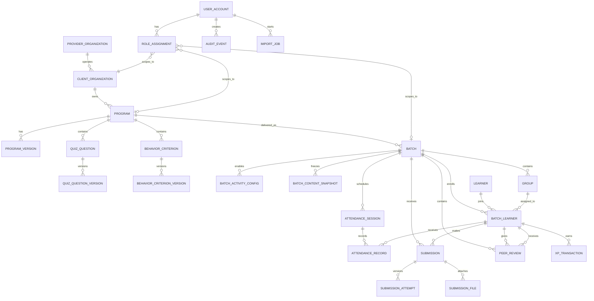

# Leadership Quest — Database Schema

> Phase 2 design baseline derived from `MASTER_PRODUCT_SPEC.md`.
>
> This is a logical schema for review before choosing the database engine and writing migrations.

## 1. Design principles

- Every business record is scoped to a Client Organization.
- Program content is reusable; a Batch receives immutable content snapshots when it starts.
- XP is append-only transactions, not a mutable balance.
- Learner submissions and Post-test attempts are retained for audit and reporting.
- Soft Delete is used for records referenced by results or XP.
- Every mutation that affects learning, access, scores, files, or configuration is auditable.
- Import jobs validate and preview before an atomic commit.
- Provider Admins and Facilitators receive explicit scope assignments.

## 2. Logical hierarchy

```text
provider_organization
  └── client_organization
        └── program
              ├── quiz_question_version
              ├── behavioral_criterion_version
              └── batch
                    ├── batch_activity_config
                    ├── batch_content_snapshot
                    ├── group
                    │     └── batch_learner
                    ├── attendance_record
                    ├── submission / submission_attempt
                    ├── peer_review
                    ├── xp_transaction
                    └── report snapshot / export job
```

## 3. Entity relationship diagram



## 4. Identity, organization, and access

### provider_organization
- `id` UUID PK
- `name`
- `status`
- `created_at`, `updated_at`

### client_organization
- `id` UUID PK
- `provider_organization_id` FK
- `name`, `external_code`
- `status`
- `deleted_at`
- Unique: (`provider_organization_id`, `external_code`)

### user_account
- `id` UUID PK
- `email` normalized unique
- `display_name`
- `account_type`: ADMIN | FACILITATOR | LEARNER
- `status`: INVITED | ACTIVE | SUSPENDED | DELETED
- `last_login_at`
- `created_at`, `updated_at`, `deleted_at`

### role_assignment
- `id` UUID PK
- `user_id` FK
- `role`: ADMIN | FACILITATOR | LEARNER
- `client_organization_id` FK nullable for provider-wide Admin
- `program_id` FK nullable
- `batch_id` FK nullable
- `created_by` FK
- `created_at`, `revoked_at`

Rules:
- Facilitator assignments must include at least a Client Organization and may narrow to Program/Batch.
- A Learner’s operational scope is established through `batch_learner`.
- Provider-wide Admin scope is explicit and auditable; do not infer it from email.

## 5. Program and reusable content

### program
- `id` UUID PK
- `client_organization_id` FK
- `name`, `description`
- `status`: DRAFT | ACTIVE | ARCHIVED
- `current_version_id` FK nullable
- `created_at`, `updated_at`, `deleted_at`

### program_version
- `id` UUID PK
- `program_id` FK
- `version_number`
- `status`: DRAFT | PUBLISHED | ARCHIVED
- `published_at`, `created_by`
- Unique: (`program_id`, `version_number`)

### quiz_question / quiz_question_version
- Question identity is stable; question text/options/answer live in a version.
- Version fields: `question_text`, `option_a`, `option_b`, `option_c`, `option_d`, `correct_option`, `topic`, `difficulty`, `sort_order`
- `deleted_at` supports Soft Delete.
- A published Batch snapshot references the exact question version.

### behavior_criterion / behavior_criterion_version
- Stable criterion identity plus versioned description and scale labels.
- MVP seed criteria: Strategic Thinking, Coaching, Growth Mindset, Team Execution, Agility.
- A published Batch snapshot references exact criterion versions.

## 6. Batch delivery and configuration

### batch
- `id` UUID PK
- `program_id` FK
- `name`, `external_code`
- `start_date`, `end_date`
- `status`: DRAFT | READY | ACTIVE | COMPLETED | ARCHIVED
- `started_at`, `completed_at`
- `created_at`, `updated_at`, `deleted_at`
- Unique: (`program_id`, `external_code`)

### batch_activity_config
One row per activity type in a Batch:
- `id` UUID PK
- `batch_id` FK
- `activity_type`: PRE_TEST | POST_TEST | SELF_BEFORE | SELF_AFTER | PEER_REVIEW | ASSIGNMENT
- `activity_key`: e.g. `assignment_1`
- `enabled`
- `gate_state`: OPEN | LOCKED
- `due_at` nullable
- `config_json` for assignment mode, required fields, and display settings
- Unique: (`batch_id`, `activity_type`, `activity_key`)

Rules:
- MVP allows 0–3 Assignment rows.
- Gate state is valid only when `enabled = true`.
- Disabled activities are excluded from reporting denominators.

### batch_content_snapshot
- `id` UUID PK
- `batch_id` FK
- `program_version_id` FK
- `snapshot_json` or normalized snapshot join tables
- `created_at`
- Immutable after Batch start.
- Snapshot must identify every Quiz Question Version and Behavior Criterion Version used by the Batch.

## 7. Learners, Groups, and Attendance

### learner_profile
- `user_id` UUID PK/FK to user_account
- `employee_code` nullable
- `locale`
- `archetype_id` nullable (cosmetic)
- `created_at`, `updated_at`

### group
- `id` UUID PK
- `batch_id` FK
- `name`, `external_code`
- `status`
- `deleted_at`
- Unique: (`batch_id`, `external_code`)

### batch_learner
- `id` UUID PK
- `batch_id` FK
- `learner_id` FK
- `group_id` FK
- `enrollment_status`: INVITED | ACTIVE | COMPLETED | WITHDRAWN
- `enrolled_at`, `completed_at`
- Unique: (`batch_id`, `learner_id`)

### attendance_session
- `id` UUID PK
- `batch_id` FK
- `session_number` (1–5)
- `session_date`
- Unique: (`batch_id`, `session_number`)

### attendance_record
- `id` UUID PK
- `session_id` FK
- `batch_learner_id` FK
- `status`: PRESENT | ABSENT | EXCUSED
- `recorded_by` FK
- `recorded_at`
- Unique: (`session_id`, `batch_learner_id`)

Attendance XP is created/voided through XP transactions; it is not calculated only from a mutable checkbox.

## 8. Activity submissions and files

### submission
- `id` UUID PK
- `batch_id` FK
- `batch_learner_id` FK
- `activity_config_id` FK
- `activity_type`
- `status`: NOT_STARTED | IN_PROGRESS | SUBMITTED | PASSED | NEEDS_REVISION | REVIEWED | LATE
- `first_submitted_at`, `last_submitted_at`
- `passed_at`, `reviewed_at`, `reviewed_by`
- Unique: (`activity_config_id`, `batch_learner_id`)

### submission_attempt
- `id` UUID PK
- `submission_id` FK
- `attempt_number`
- `response_json`
- `score_percent` nullable
- `pass_state`: NOT_APPLICABLE | FAILED | PASSED
- `question_order_json` for Post-test presentation order
- `submitted_at`
- Unique: (`submission_id`, `attempt_number`)

Rules:
- Post-test requires >=80%; failed learners may retry while the Gate is open; after first pass, the submission is locked.
- Assignment attempts have no numeric grade; Facilitator uses status and feedback.
- XP is idempotently awarded once per qualifying activity.

### submission_file
- `id` UUID PK
- `submission_attempt_id` FK
- `storage_key` (never a public URL)
- `original_filename`, `mime_type`, `size_bytes`
- `scan_status`: PENDING | CLEAN | REJECTED
- `uploaded_at`, `deleted_at`
- Max 20 MB/file and 3 files/Assignment, with approved MIME types only.

### facilitator_feedback
- `id` UUID PK
- `submission_id` FK
- `facilitator_id` FK
- `status`: REVIEWED | NEEDS_REVISION
- `feedback_text`
- `created_at`, `updated_at`, `deleted_at`

## 9. Peer Review

### peer_review
- `id` UUID PK
- `batch_id` FK
- `reviewer_batch_learner_id` FK
- `reviewee_batch_learner_id` FK
- `rating` 1–5
- `comment`
- `status`: SUBMITTED | HIDDEN
- `submitted_at`
- Unique: (`batch_id`, `reviewer_batch_learner_id`, `reviewee_batch_learner_id`)
- Check: reviewer != reviewee

Reviewer identity is hidden from the reviewee in the Learner UI but retained for Admin audit/moderation.

## 10. XP, ranking, and reporting

### xp_transaction
- `id` UUID PK
- `client_organization_id` FK
- `batch_id` FK
- `batch_learner_id` FK
- `source_type`: ATTENDANCE | RAPID_GROUP | PRE_TEST | POST_TEST | SELF_BEFORE | SELF_AFTER | PEER_REVIEW | ASSIGNMENT | LIVE_ADJUSTMENT
- `source_id` nullable
- `amount` signed integer
- `reason` required for LIVE_ADJUSTMENT
- `idempotency_key` unique
- `created_by` FK nullable for system award
- `created_at`
- No update/delete; corrections are compensating transactions.

Approved award limits must be enforced server-side. Leaderboard sorts XP descending, then timestamp of reaching the tied total ascending, then normalized name alphabetically.

### report_export_job
- `id` UUID PK
- `batch_id` FK
- `requested_by` FK
- `status`: QUEUED | RUNNING | COMPLETED | FAILED
- `storage_key`, `created_at`, `expires_at`

Reports use enabled activities only. Post-test report values use each Learner’s first passing attempt, aggregated as the selected Batch cohort average.

## 11. Import, audit, and operations

### import_job / import_row_error
- Import types: LEARNER_ROSTER | QUIZ_BANK | BEHAVIOR_CRITERIA
- Job status: UPLOADED | VALIDATING | PREVIEW | CONFIRMED | COMMITTED | FAILED
- Store template version, source filename, uploader, Batch/Program scope, row counts, and error rows.
- Commit is atomic; invalid previews never partially write.

### audit_event
- `id` UUID PK
- `actor_user_id` FK nullable for system event
- `client_organization_id` FK nullable
- `batch_id` FK nullable
- `event_type`, `target_type`, `target_id`
- `before_json`, `after_json`, `reason`
- `ip_hash`, `user_agent` (subject to privacy review)
- `created_at`
- Append-only; retain at least 2 years after Batch completion.

### retention_job
- Tracks eligible records, approval, execution, and evidence for permanent deletion.
- Soft Delete is the default; hard deletion requires an approved retention job.

## 12. Initial constraints and indexes

Required uniqueness/constraints:
- One learner enrollment per Batch.
- One Group membership per Batch enrollment.
- One attendance record per session/learner.
- One Peer Review per reviewer/reviewee/Batch.
- One XP award per idempotency key.
- One activity configuration per Batch/activity key.
- No self-review.
- No cross-Client Organization foreign-key references.

Recommended indexes:
- `batch_learner(batch_id, group_id, enrollment_status)`
- `submission(batch_id, activity_type, status)`
- `submission_attempt(submission_id, attempt_number)`
- `xp_transaction(batch_id, batch_learner_id, created_at)`
- `audit_event(client_organization_id, batch_id, created_at)`
- `import_job(status, created_at)`

## 13. Migration and seed sequence

1. Create provider/client organization and user/account tables.
2. Create Program, versioned content, Batch, Group, and enrollment tables.
3. Create Batch activity configuration and content snapshot tables.
4. Create attendance, submissions, files, peer review, and feedback tables.
5. Create XP transaction, report export, import, audit, and retention tables.
6. Add constraints, indexes, and soft-delete policies.
7. Seed development-only data with no real personal information:
   - one provider organization
   - two client organizations
   - two Programs across clients
   - two Batches with different enabled activities
   - groups, learners, five attendance sessions
   - versioned quiz/criteria examples
   - sample submissions and XP transactions
8. Run isolation, idempotency, snapshot, and restore tests before staging.

## 14. Approved implementation stack

- **Database:** Supabase-managed PostgreSQL.
- **Identity:** Supabase Auth with individual Admin, Facilitator, and Learner accounts.
- **Authorization:** PostgreSQL Row-Level Security plus server-side policy checks for role and Client Organization/Program/Batch scope.
- **Files:** Private Supabase Storage bucket with signed URLs, malware-scan status, and audit events.
- **Migrations:** Versioned SQL migrations executed through the Supabase CLI in Development → Staging → Production.
- **Trusted operations:** Server-side Edge Functions/service layer for XP, imports, file access, audit, and idempotent mutations.

## 15. Remaining implementation choices

- Whether snapshots use normalized join tables, immutable JSON, or both.
- Exact score-release UI fields for Admin versus Learner.
- Production RPO/RTO validation with the selected hosting configuration.
